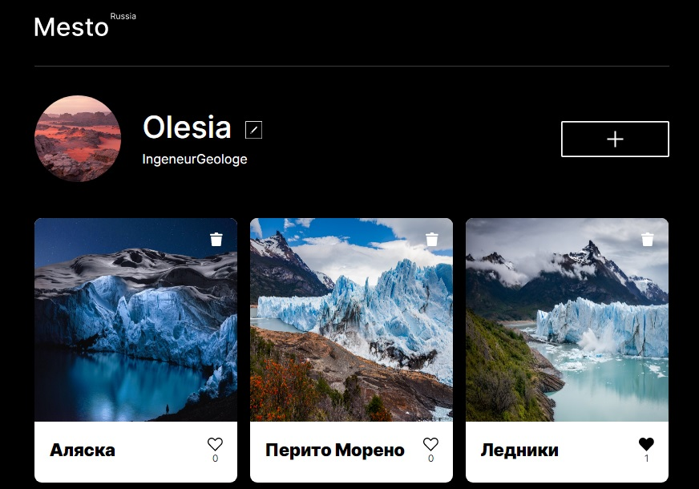
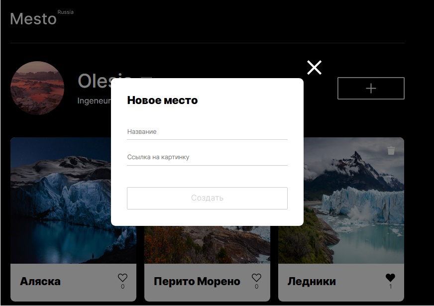
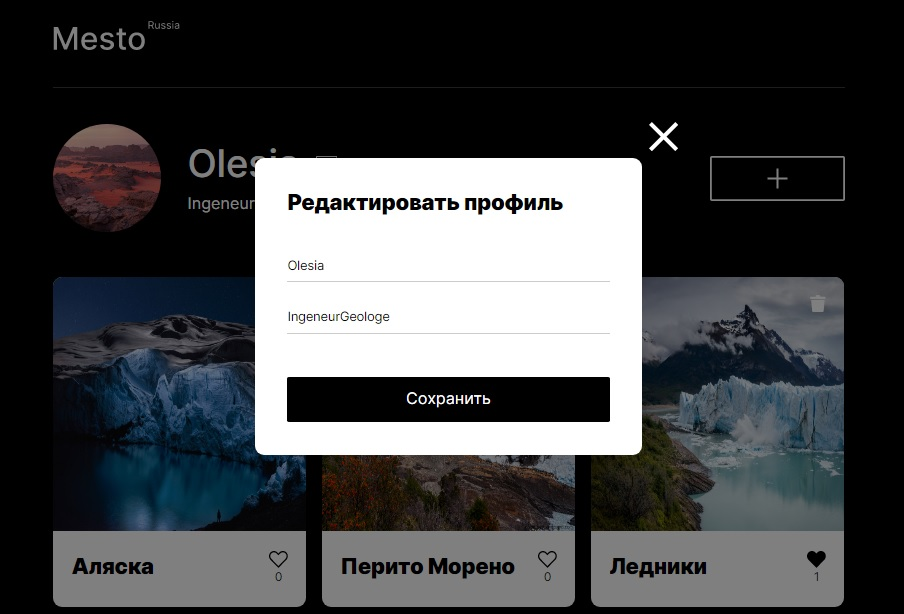
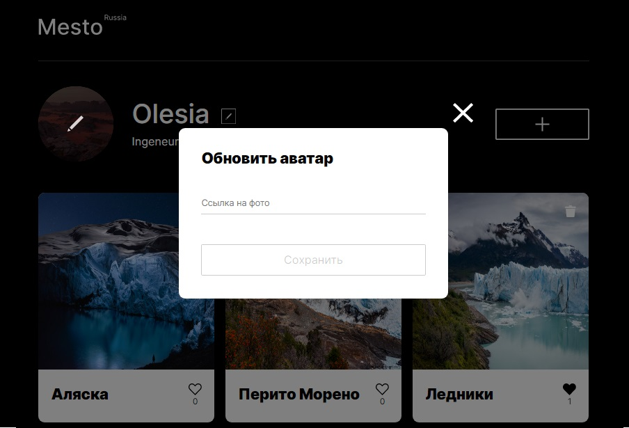

# Проект: Mesto

### О проекте

[`Mesto`](https://olesia1205.github.io/mesto/index.html) - сайт, где можно делиться фотографиями, ставить карточкам лайки или дизлайки.     
Первоначальные данные о пользователе и карточках подгружаются с сервера.    
Реализована возможность редактирования профиля пользователя, смены аватара.    
По клику можно посмотреть картинку в большем масштабе (zoom).    
Есть возможность удалять карточки.     
Реализовано всплывающее подтверждение для удаления карточек.      
Закрытие попапов по Overlay и Escape.

 `Используемые технологии:`

- [x] Верстка сайта с использованием HTML5 и CSS3
- [x] Файловая структура проекта БЭМ (Nested)
- [x] Создание попапов и форм
- [x] Валидация форм
- [x] Объектно-ориентированный подход
- [x] Асинхронный код
- [x] Запросы к API
- [x] Сборка проекта Webpack
- [x] Транспиляция JS инструментами Babel

 `Запуск проекта`

1. Клонировать репозиторий

    `git clone https://github.com/olesia1205/mesto.git`

2. Установить зависимости

    `cd mesto`
    
    `npm install`

3. Для запуска использовать команды

    `npm run dev`

    Запуск проекта в режиме разработки.
    Для просмотра результатов в браузере откройте http://localhost:8080
    После внесения изменений страница перезагрузится автоматически

    `npm run build`

    Создает финальную сборку проекта, готовую для развертывания, в папке `dist`

***

